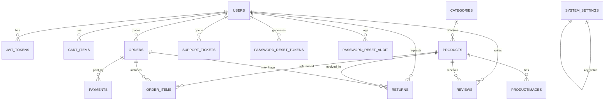
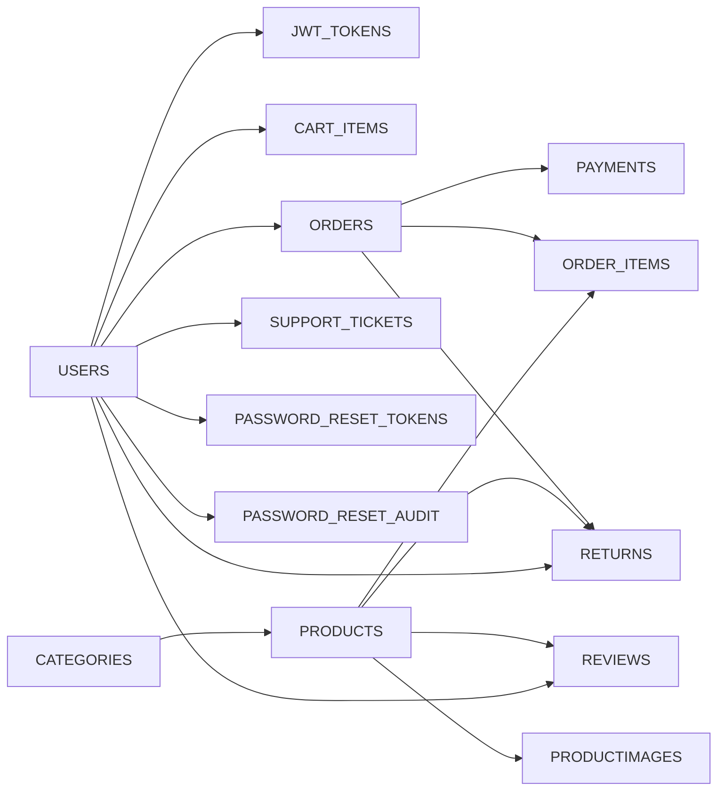

# ShopFusion Database Schema

## Notes
- The primary schema is defined in `shopfusionBackEnd\src\main\resources\db\shopfusion_schema.sql`.
- Additional tables are created by JPA when `spring.jpa.hibernate.ddl-auto=update` is enabled.
- The tables below combine SQL scripts and entity definitions.

## ER Diagram

## Database Relationship Diagram

---

## Tables

### users
| Column | Type | Constraints | Description |
|---|---|---|---|
| user_id | INT | PK, auto-increment | User identifier |
| username | VARCHAR(255) | UNIQUE, NOT NULL | Login username |
| email | VARCHAR(255) | UNIQUE, NOT NULL | Login email |
| password | VARCHAR(255) | NOT NULL | BCrypt hash |
| role | ENUM(ADMIN,CUSTOMER) | NOT NULL | Access role |
| phone | VARCHAR(20) | NULL | Phone number |
| avatar_url | LONGTEXT | NULL | Profile image URL |
| address_line1 | VARCHAR(255) | NULL | Address line 1 |
| address_line2 | VARCHAR(255) | NULL | Address line 2 |
| city | VARCHAR(100) | NULL | City |
| state | VARCHAR(100) | NULL | State |
| postal_code | VARCHAR(20) | NULL | Postal code |
| country | VARCHAR(100) | NULL | Country |
| blocked | TINYINT(1) | NOT NULL | Account block flag |
| status | VARCHAR(20) | NOT NULL | ACTIVE or BLOCKED |
| last_login_at | TIMESTAMP | NULL | Last login timestamp |
| created_at | TIMESTAMP | NOT NULL | Created timestamp |
| updated_at | TIMESTAMP | NOT NULL | Updated timestamp |

### jwt_tokens
| Column | Type | Constraints | Description |
|---|---|---|---|
| token_id | INT | PK, auto-increment | Token record id |
| user_id | INT | FK -> users.user_id | User reference |
| token | VARCHAR(1024) | UNIQUE, NOT NULL | JWT token |
| expires_at | TIMESTAMP | NOT NULL | Expiration time |

### password_reset_tokens
| Column | Type | Constraints | Description |
|---|---|---|---|
| id | INT | PK, auto-increment | Token record id |
| user_id | INT | FK -> users.user_id | User reference |
| token | VARCHAR(255) | UNIQUE, NOT NULL | Reset token |
| expires_at | DATETIME | NOT NULL | Expiration time |
| created_at | DATETIME | NOT NULL | Created time |

### password_reset_audit
| Column | Type | Constraints | Description |
|---|---|---|---|
| id | INT | PK, auto-increment | Audit id |
| action | VARCHAR(255) | NOT NULL | Audit action label |
| user_id | INT | NULL | User reference |
| identifier | VARCHAR(255) | NULL | Username or email |
| ip_address | VARCHAR(255) | NULL | Request IP |
| user_agent | VARCHAR(255) | NULL | Request user agent |
| created_at | DATETIME | NOT NULL | Audit timestamp |

### categories
| Column | Type | Constraints | Description |
|---|---|---|---|
| category_id | INT | PK, auto-increment | Category id |
| category_name | VARCHAR(255) | UNIQUE, NOT NULL | Category name |
| image_url | TEXT | NULL | Image URL |

### products
| Column | Type | Constraints | Description |
|---|---|---|---|
| product_id | INT | PK, auto-increment | Product id |
| name | VARCHAR(255) | NOT NULL | Product name |
| description | TEXT | NULL | Product description |
| price | DECIMAL(10,2) | NOT NULL | Unit price |
| stock_quantity | INT | NOT NULL | Stock count |
| product_status | ENUM(AVAILABLE,OUT_OF_STOCK) | NOT NULL | Availability |
| category_id | INT | FK -> categories.category_id | Category |
| created_at | TIMESTAMP | NOT NULL | Created timestamp |
| updated_at | TIMESTAMP | NOT NULL | Updated timestamp |

### productimages
| Column | Type | Constraints | Description |
|---|---|---|---|
| image_id | INT | PK, auto-increment | Image id |
| product_id | INT | FK -> products.product_id | Product reference |
| image_url | TEXT | NOT NULL | Image URL |
| is_primary | TINYINT(1) | NOT NULL | Primary image flag |

### cart_items
| Column | Type | Constraints | Description |
|---|---|---|---|
| id | INT | PK, auto-increment | Cart item id |
| user_id | INT | FK -> users.user_id | User reference |
| product_id | INT | FK -> products.product_id | Product reference |
| quantity | INT | NOT NULL | Quantity |

### orders
| Column | Type | Constraints | Description |
|---|---|---|---|
| order_id | VARCHAR(255) | PK | Order id, Razorpay id or COD id |
| user_id | INT | FK -> users.user_id | Customer reference |
| subtotal_amount | DECIMAL(10,2) | NOT NULL | Item subtotal |
| shipping_amount | DECIMAL(10,2) | NOT NULL | Shipping charge |
| tax_amount | DECIMAL(10,2) | NOT NULL | Tax amount |
| total_amount | DECIMAL(10,2) | NOT NULL | Final total |
| discount_amount | DECIMAL(10,2) | NULL | Discount applied |
| coupon_code | VARCHAR(80) | NULL | Coupon code |
| shipping_address | TEXT | NULL | Shipping address |
| payment_method | VARCHAR(30) | NULL | RAZORPAY or COD |
| order_status | ENUM | NOT NULL | Lifecycle status |
| payment_status | ENUM | NOT NULL | Payment status |
| tracking_number | VARCHAR(60) | NULL | Tracking number |
| created_at | TIMESTAMP | NOT NULL | Created timestamp |
| updated_at | TIMESTAMP | NOT NULL | Updated timestamp |

### order_items
| Column | Type | Constraints | Description |
|---|---|---|---|
| id | INT | PK, auto-increment | Line item id |
| order_id | VARCHAR(255) | FK -> orders.order_id | Order reference |
| product_id | INT | FK -> products.product_id | Product reference |
| quantity | INT | NOT NULL | Quantity |
| price_per_unit | DECIMAL(10,2) | NOT NULL | Unit price |
| total_price | DECIMAL(10,2) | NOT NULL | Line total |

### payments
| Column | Type | Constraints | Description |
|---|---|---|---|
| id | BIGINT | PK, auto-increment | Payment record id |
| order_id | VARCHAR(255) | UNIQUE | Order reference |
| razorpay_payment_id | VARCHAR(255) | NULL | Razorpay payment id |
| razorpay_signature | VARCHAR(255) | NULL | Razorpay signature |
| user_id | INT | NOT NULL | Customer reference |
| amount | DECIMAL(12,2) | NOT NULL | Amount paid |
| status | VARCHAR(30) | NOT NULL | PENDING, SUCCESS, FAILED |
| created_at | TIMESTAMP | NOT NULL | Created timestamp |
| updated_at | TIMESTAMP | NOT NULL | Updated timestamp |

### coupons
| Column | Type | Constraints | Description |
|---|---|---|---|
| id | INT | PK, auto-increment | Coupon id |
| code | VARCHAR(80) | UNIQUE, NOT NULL | Coupon code |
| discount_type | VARCHAR(20) | NOT NULL | PERCENTAGE or FLAT |
| discount_value | DECIMAL(10,2) | NOT NULL | Discount value |
| minimum_order_amount | DECIMAL(10,2) | NOT NULL | Minimum order |
| maximum_discount | DECIMAL(10,2) | NOT NULL | Cap for percentage |
| expiry_date | DATE | NOT NULL | Expiry date |
| usage_limit | INT | NOT NULL | Max uses |
| used_count | INT | NOT NULL | Usage count |
| active | TINYINT(1) | NOT NULL | Active flag |
| created_at | TIMESTAMP | NOT NULL | Created timestamp |
| updated_at | TIMESTAMP | NOT NULL | Updated timestamp |

### reviews
| Column | Type | Constraints | Description |
|---|---|---|---|
| id | BIGINT | PK, auto-increment | Review id |
| user_id | INT | FK -> users.user_id | Reviewer |
| product_id | INT | FK -> products.product_id | Product reference |
| rating | INT | NOT NULL | Rating 1-5 |
| comment | VARCHAR(1200) | NOT NULL | Review text |
| created_at | TIMESTAMP | NOT NULL | Created timestamp |
| updated_at | TIMESTAMP | NOT NULL | Updated timestamp |

### returns
| Column | Type | Constraints | Description |
|---|---|---|---|
| id | BIGINT | PK, auto-increment | Return id |
| order_id | VARCHAR(255) | FK -> orders.order_id | Order reference |
| product_id | INT | FK -> products.product_id | Product reference |
| user_id | INT | FK -> users.user_id | Customer reference |
| reason | VARCHAR(500) | NULL | Return reason |
| request_type | ENUM(RETURN,REFUND) | NOT NULL | Request type |
| status | ENUM(REQUESTED,APPROVED,REJECTED,REFUNDED) | NOT NULL | Return status |
| refund_status | ENUM(PENDING,PROCESSED) | NOT NULL | Refund status |
| refund_amount | DECIMAL(12,2) | NULL | Refund amount |
| refund_reference | VARCHAR(120) | NULL | Refund reference |
| requested_at | TIMESTAMP | NOT NULL | Requested timestamp |
| approved_at | TIMESTAMP | NULL | Approved timestamp |
| updated_at | TIMESTAMP | NOT NULL | Updated timestamp |

### support_tickets
| Column | Type | Constraints | Description |
|---|---|---|---|
| id | BIGINT | PK, auto-increment | Ticket id |
| ticket_number | VARCHAR(40) | UNIQUE | Ticket code |
| user_id | INT | NOT NULL | Customer reference |
| username | VARCHAR(120) | NOT NULL | Snapshot of username |
| email | VARCHAR(160) | NOT NULL | Snapshot of email |
| phone | VARCHAR(24) | NULL | Snapshot of phone |
| order_id | VARCHAR(60) | NULL | Related order |
| type | ENUM | NOT NULL | Ticket type |
| priority | ENUM | NOT NULL | Ticket priority |
| status | ENUM | NOT NULL | Ticket status |
| subject | VARCHAR(180) | NOT NULL | Subject |
| message | TEXT | NOT NULL | Message |
| admin_note | TEXT | NULL | Admin note |
| created_at | DATETIME | NOT NULL | Created timestamp |
| updated_at | DATETIME | NOT NULL | Updated timestamp |
| resolved_at | DATETIME | NULL | Resolved timestamp |

### system_settings
| Column | Type | Constraints | Description |
|---|---|---|---|
| id | BIGINT | PK, auto-increment | Setting record id |
| setting_key | VARCHAR(120) | UNIQUE, NOT NULL | Setting key |
| setting_value | TEXT | NOT NULL | Setting value |
| updated_at | TIMESTAMP | NOT NULL | Updated timestamp |

---

## Constraints and Indexes
- Unique constraints exist on usernames, emails, coupon codes, and support ticket numbers
- Foreign keys enforce integrity between users, orders, products, and payments
- A composite unique key on cart items prevents duplicate product rows per user

## Migrations and Seed Data
- Schema: `shopfusion_schema.sql`
- Seed data: `shopfusion_seed.sql`
- Settings migration: `shopfusion_settings_migration.sql`
- Non-destructive migration: `shopfusion_migration_20260310.sql`
