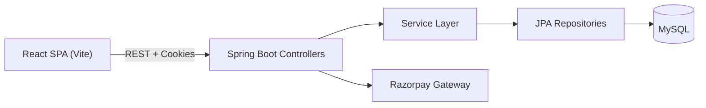
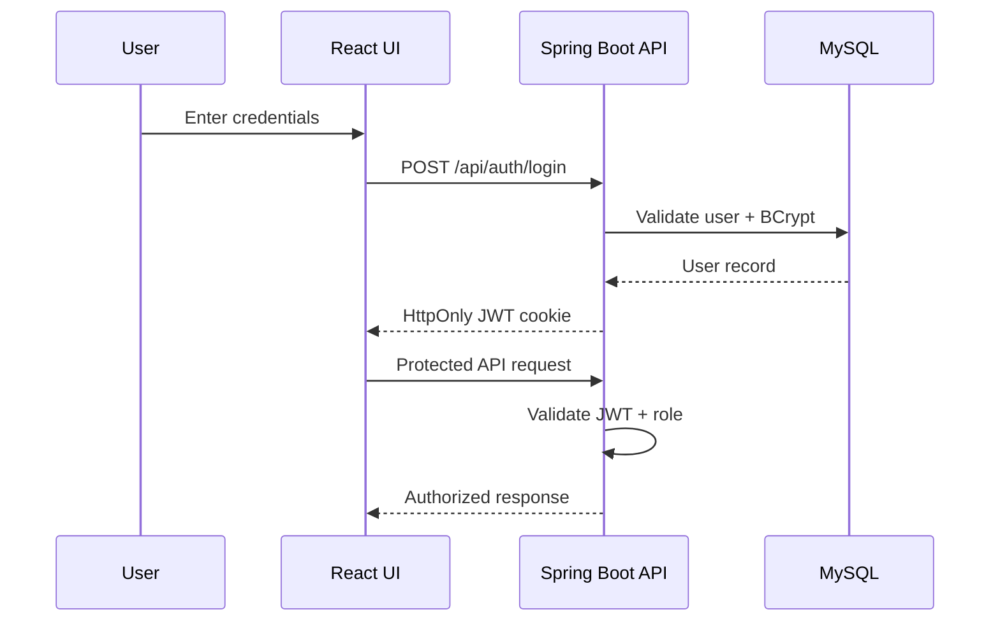

# ShopFusion
Full-Stack E-Commerce System
Project Report

Prepared By: Anupam Kumar
Date: March 2026

---

## Table of Contents
1. Project Overview
2. Technology Stack
3. System Architecture
4. Features
5. Modules
6. Database Design
7. API Documentation
8. Workflow
9. Key Logic / Algorithms
10. Security Features
11. Challenges Faced
12. Future Improvements
13. Interview Preparation
14. 30-Second Interview Explanation

---

# 1. Project Overview

## 1.1 Project Title
ShopFusion

## 1.2 Project Description
ShopFusion is a full-stack e-commerce platform that mirrors real-world shopping operations. Customers can browse products, apply coupons, manage carts, and complete checkout using Razorpay or Cash on Delivery. The system uses JWT authentication stored in HttpOnly cookies and enforces role-based access control for admin features. Admin workflows include catalog management, order processing, coupon control, analytics, support ticketing, and store settings. The backend is built with Spring Boot and persists data in MySQL via JPA/Hibernate.

## 1.3 Problem Statement
Retail teams often lack a unified platform for catalog, checkout, order tracking, and customer support, which creates operational inefficiencies and a fragmented customer experience.

## 1.4 Objective
Build a scalable, secure end-to-end commerce system that includes customer and admin workflows from discovery through post-purchase support.

## 1.5 Target Users
- Online shoppers
- Store administrators and operations teams
- Business owners managing catalog and sales

---

# 2. Technology Stack

Frontend
- React 19, React Router 7, Vite 7
- Tailwind CSS 4, custom CSS
- Axios, Recharts, Framer Motion, Lottie

Backend
- Spring Boot 3.4 (Java 17)
- Spring Web, Spring Data JPA
- JWT (jjwt), BCrypt
- Razorpay Java SDK
- JavaMail for password reset

Database
- MySQL

Tools
- Maven, Node.js, npm

---

# 3. System Architecture

## 3.1 Frontend to Backend Communication
The React SPA communicates with the backend via REST APIs. Authenticated requests include cookies for JWT. Admin requests are enforced by a role check in the backend filter.

## 3.2 Backend to Database Interaction
Spring Data JPA repositories map entities to tables and perform CRUD and query-based operations. Transactional flows ensure stock and order consistency.

## 3.3 Overall Application Flow
1. User logs in and receives a JWT cookie
2. Products are fetched via `/api/products`
3. Cart actions are handled via `/api/cart/*`
4. Checkout calculates totals, shipping, tax, and coupon discount
5. Payment is initiated via Razorpay or COD
6. Payment verification confirms order and updates stock
7. User tracks orders and can request returns or refunds

### Architecture Diagram

### Authentication and Authorization Flow

---

# 4. Features

Customer
- Registration, login, logout, profile updates
- Product discovery with category filtering and search
- Product detail pages with images and reviews
- Cart management with stock validation
- Coupon discovery and validation
- Checkout with shipping, tax, and payment method rules
- Razorpay and COD payment flows
- Order history and tracking
- Return and refund requests
- Support ticket creation and help center content

Admin
- Dashboard KPIs and business analytics
- Product and category management
- Order status updates and return handling
- Customer search and account control
- Coupon management
- Support ticket queue and reset audit logs
- Store configuration and settings management

---

# 5. Modules

## 5.1 Authentication Module
- JWT issued on login, stored in HttpOnly cookies
- Custom authentication filter for `/api` and `/admin`
- Admin role enforcement and blocked user checks

## 5.2 Catalog Module
- Product and category CRUD on admin side
- Customer listing, details, and inventory checks

## 5.3 Cart and Checkout Module
- Cart add, update, delete with stock validation
- Checkout totals derived from system settings

## 5.4 Payment Module
- Razorpay order creation and signature verification
- COD order creation and stock reservation

## 5.5 Orders and Returns Module
- User order history with totals and status
- Return requests only after delivery
- Return requests create support tickets

## 5.6 Support Module
- Customer tickets, help center content, and contact details
- Admin ticket queue and updates

## 5.7 Admin Dashboard Module
- Business metrics, order ops, user management, and settings

---

# 6. Database Design

Key tables
- users, jwt_tokens, password_reset_tokens, password_reset_audit
- categories, products, productimages
- cart_items, orders, order_items
- payments, coupons, reviews
- returns, support_tickets, system_settings

Relationships
- One user -> many orders, cart items, support tickets
- One order -> many order_items
- One product -> many productimages, order_items, reviews
- One category -> many products

ER diagram is available in `DATABASE_SCHEMA.md`.

---

# 7. API Documentation

Customer APIs
- `/api/auth/*`, `/api/users/*`, `/api/products/*`, `/api/cart/*`
- `/api/payment/*`, `/api/orders/*`, `/api/support/*`

Admin APIs
- `/admin/dashboard/*`, `/admin/business/*`, `/admin/products/*`
- `/admin/orders/*`, `/admin/users/*`, `/admin/coupons/*`

Full API documentation is in `API_DOCUMENTATION.md`.

---

# 8. Workflow

1. User logs in and receives JWT cookie
2. Frontend fetches products and categories
3. User adds items to cart; stock is validated
4. Checkout calculates totals using system settings
5. Payment order is created or COD is placed
6. Verification confirms order and updates inventory
7. User tracks orders and can request returns

Workflow diagrams are in `WORKFLOW.md`.

---

# 9. Key Logic / Algorithms
- JWT auth with cookie-based sessions
- Stock validation during cart updates and payment verification
- Totals calculation with shipping, tax, and coupon rules
- Razorpay signature verification
- Return workflow and support ticket creation

---

# 10. Security Features
- BCrypt hashing
- JWT signing with HS512
- HttpOnly cookies
- Role-based access control
- Captcha + rate limiting on password reset

---

# 11. Challenges Faced
- Consistent SPA auth handling across customer and admin routes
- Stock consistency across cart and payment flows
- Totals calculation with dynamic settings

---

# 12. Future Improvements
- Refresh token rotation and session analytics
- Redis caching for products and settings
- Advanced search and indexing
- CI pipeline with full test suite
- Notification system for orders and support updates

---

# 13. Interview Preparation

1. Why use JWT with cookies?
HttpOnly cookies reduce token exposure to XSS and simplify session handling.

2. How do you prevent overselling?
Stock is validated on cart operations and again during payment confirmation with row locking.

3. What happens if payment verification fails?
The order is marked failed and payment status is updated accordingly.

4. How are discounts applied?
Coupon validation checks expiry, usage limits, and minimum order amount.

5. How are shipping charges calculated?
Shipping rules are pulled from `system_settings` and applied in PaymentService.

6. How is admin access secured?
A role check in `AuthenticationFilter` blocks non-admins from `/admin` routes.

7. How do return requests work?
Returns are allowed only after delivery and generate support tickets.

8. Why use JPA?
It reduces boilerplate and maps entities to SQL tables cleanly.

9. What are the most important tables?
users, products, orders, order_items, payments, returns.

10. How is payment confirmed?
Razorpay signature verification ensures authenticity.

11. How does the system handle coupons?
Coupons are validated for activity, expiry, and usage limits.

12. How are settings managed?
Settings are stored in `system_settings` and cached in the backend.

13. How is password reset protected?
Captcha, rate limiting, and audit logging are enforced.

14. What would you improve next?
Add background jobs for notifications and robust observability.

15. How is admin visibility ensured?
Admin dashboards and audit logs provide operational insight.

---

# 14. 30-Second Interview Explanation
ShopFusion is a full-stack e-commerce platform built with React and Spring Boot. It covers the entire shopping lifecycle from product discovery and cart management to checkout and payment via Razorpay or COD. Authentication uses JWT stored in HttpOnly cookies, and admin workflows handle catalog, orders, customers, coupons, and support tickets. The system ensures stock consistency, provides configurable shipping and tax rules, and stores all data in MySQL with JPA.
