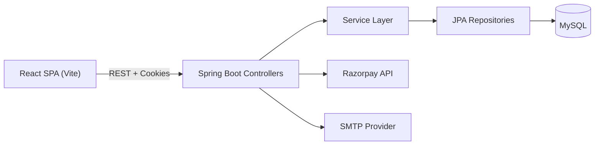

# ShopFusion - Full Stack E-Commerce Platform

## Project Title
ShopFusion

## Project Overview
ShopFusion is a full-stack e-commerce platform that delivers a complete customer shopping journey and a dedicated admin operations console. The frontend is a React (Vite) single-page app and the backend is a Spring Boot REST API backed by MySQL. Authentication uses JWT stored in HttpOnly cookies, and core flows include catalog browsing, cart management, checkout, payments, order tracking, returns, and customer support.

## Problem Statement
Growing retail teams often juggle separate tools for catalog management, secure checkout, order lifecycle, and post-purchase support. That fragmentation leads to operational bottlenecks and inconsistent customer experiences.

## Solution Description
ShopFusion consolidates customer and admin workflows into a single platform. The customer app focuses on browsing, cart, checkout, and support. The admin console provides catalog management, order operations, customer management, coupon control, analytics, and system settings. A Spring Boot API enforces role-based access, secures sessions via JWT cookies, and coordinates payments via Razorpay or COD.

## Complete Feature List
Customer features
- Account registration, login, logout, and profile management
- Product listing with search and category filtering
- Product detail page with images and reviews
- Cart management with stock validation
- Coupon discovery and validation
- Checkout with shipping, tax, and payment method selection
- Razorpay checkout and COD flow
- Order history with tracking and return requests
- Support center content and ticketing
- Password reset with captcha and rate limiting

Admin features
- Business dashboard overview and analytics
- Product and category CRUD with image management
- Order status and return management
- Customer search, block/unblock, and profile edits
- Coupon lifecycle management
- Support ticket queue and reset audit logs
- System settings for store, shipping, tax, and payment options
- Password reset email template editing

For a full breakdown, see `FEATURES.md`.

## Tech Stack
Frontend
- React 19, React Router 7, Vite 7
- Tailwind CSS 4, custom CSS
- Axios, Fetch
- Recharts, Framer Motion, Lottie

Backend
- Spring Boot 3.4 (Java 17)
- Spring Web, Spring Data JPA
- JWT (jjwt), BCrypt
- Razorpay Java SDK
- JavaMail (password reset emails)

Database
- MySQL

Tools
- Maven, Node.js, npm

## System Architecture Overview


## Folder Structure
```
ShopFusion/
+-- ShopFusionFrontend/          # React customer + admin UI
+-- shopfusionBackEnd/           # Spring Boot REST API
+-- dashboard_import/         # Separate admin dashboard template
+-- README.md                 # Main project documentation
+-- DOCUMENTATION_INDEX.md    # Documentation landing page
+-- ARCHITECTURE.md           # System architecture
+-- API_DOCUMENTATION.md      # API reference
+-- DATABASE_SCHEMA.md        # Database schema and ERD
+-- FEATURES.md               # Feature inventory
+-- WORKFLOW.md               # Workflows and sequence diagrams
+-- DEPLOYMENT.md             # Deployment guide
```

See `FOLDER_STRUCTURE.md` for a complete breakdown.

## Installation Instructions
Prerequisites
- Java 17
- Maven 3.9+
- Node.js 18+
- MySQL 8+

Backend setup
1. Configure database and secrets in `C:\Users\anupa\OneDrive\Desktop\ShopFusion\shopfusionBackEnd\src\main\resources\application.properties`.
2. Run the backend:
```bash
cd shopfusionBackEnd
./mvnw spring-boot:run
```
Backend runs at `http://localhost:9090`.

Frontend setup
1. Configure API base URL in `C:\Users\anupa\OneDrive\Desktop\ShopFusion\ShopFusionFrontend\.env.local`:
```
VITE_API_URL=http://localhost:9090
```
2. Run the frontend:
```bash
cd ShopFusionFrontend
npm install
npm run dev
```
Frontend runs at `http://localhost:5174`.

## Running the Application
1. Start MySQL and ensure the `shopfusion` database is available.
2. Start the backend on port 9090.
3. Start the frontend on port 5174.
4. Open `http://localhost:5174` for customer login.
5. Open `http://localhost:5174/admin` for admin login.

Admin bootstrap credentials
- Username and password are defined in `C:\Users\anupa\OneDrive\Desktop\ShopFusion\shopfusionBackEnd\src\main\resources\application.properties` under `admin.bootstrap.*`.

## Environment Variables
Frontend
- `VITE_API_URL` = backend base URL

Backend (recommended as environment variables in production)
- `SPRING_DATASOURCE_URL`
- `SPRING_DATASOURCE_USERNAME`
- `SPRING_DATASOURCE_PASSWORD`
- `JWT_SECRET`
- `RAZORPAY_KEY_ID`
- `RAZORPAY_KEY_SECRET`
- `SPRING_MAIL_HOST`, `SPRING_MAIL_PORT`, `SPRING_MAIL_USERNAME`, `SPRING_MAIL_PASSWORD`

See `DEPLOYMENT.md` for production guidance.

## Build Instructions
Frontend
```bash
cd ShopFusionFrontend
npm run build
```
Output: `ShopFusionFrontend\dist`

Backend
```bash
cd shopfusionBackEnd
./mvnw -DskipTests package
```
Output: `shopfusionBackEnd\target\*.jar`

## Deployment Instructions
- Backend can be deployed as a Spring Boot jar or via Docker (see `shopfusionBackEnd\Dockerfile`).
- Frontend can be deployed to Vercel, Netlify, or any static host.

Full deployment instructions are in `DEPLOYMENT.md`.

## Screenshots
Place product screenshots in the repository and reference them here. Example assets currently in the repo:
- `ShopFusionFrontend\public\background.png`
- `ShopFusionFrontend\public\background1.png`
- `ShopFusionFrontend\public\shipped.jpg`

## Future Enhancements
- Refresh token rotation and session management dashboard
- Background jobs for emails and order notifications
- Redis caching for product and settings
- Advanced search and faceted filtering
- CI pipeline with automated tests and linting

## Additional Docs
- `DOCUMENTATION_INDEX.md`
- `ARCHITECTURE.md`
- `API_DOCUMENTATION.md`
- `DATABASE_SCHEMA.md`
- `FEATURES.md`
- `WORKFLOW.md`
- `SECURITY.md`
- `DEPLOYMENT.md`
- `CONTRIBUTING.md`
- `FOLDER_STRUCTURE.md`

Deployment note: this commit triggers a fresh Vercel build.
