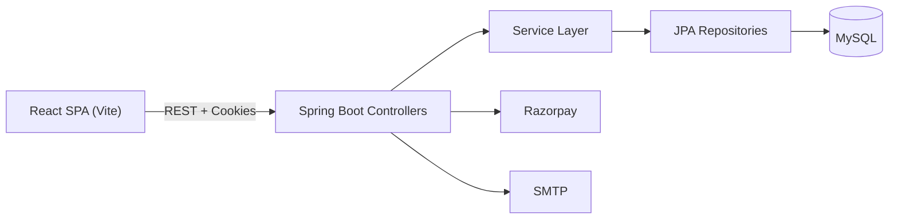

# ShopFusion Project Documentation

Generated on: 2026-03-16

## 1. Overview
ShopFusion is a full-stack e-commerce platform with a customer storefront and an admin operations console. The frontend is a React (Vite) SPA and the backend is a Spring Boot REST API using JPA/Hibernate with a MySQL database. Authentication is JWT-based with HttpOnly cookies. The system supports catalog browsing, cart management, checkout with Razorpay or COD, order tracking, return requests, and a support ticket system.

## 2. Repository Layout
- `ShopFusionFrontend/` React app for customer and admin UI
- `shopfusionBackEnd/` Spring Boot API and data layer
- `dashboard_import/react-admin-dashboard-master/` Separate admin dashboard template (not integrated)
- Root docs: README, architecture, workflow, API, database schema

## 3. Tech Stack
Frontend
- React 19, React Router 7, Vite 7
- Tailwind CSS 4, custom CSS
- Axios, Fetch
- Recharts, Framer Motion, Lottie

Backend
- Spring Boot 3.4 (Java 17)
- Spring Web, Spring Data JPA
- JWT (jjwt), BCrypt
- Razorpay Java SDK
- JavaMail for password reset emails

Database
- MySQL

Tools
- Maven, Node.js, npm

## 4. System Architecture
### 4.1 High-Level Flow
React UI -> Spring Boot Controllers -> Service Layer -> JPA Repositories -> MySQL

### 4.2 System Diagram

### 4.3 Authentication and Authorization
- JWT stored as HttpOnly cookie `authToken`
- `AuthenticationFilter` protects `/api/*` and `/admin/*`
- Admin routes require `Role.ADMIN`
- Blocked users are denied access

## 5. Frontend Architecture
Entry points
- `ShopFusionFrontend\src\main.jsx` and `ShopFusionFrontend\src\App.jsx`

Routes
- Customer and support routes in `ShopFusionFrontend\src\routes\Routes.jsx`
- Admin routes under `/admindashboard`

Key UI modules
- `components/layout` Header, Footer, Logo, ThemeToggle
- `components/cart` Cart UI and modal
- `components/ui` Toasts, skeletons, notices
- `admin/*` Admin layout, pages, services

Admin API client
- `ShopFusionFrontend\src\admin\services\adminApi.js`

## 6. Backend Architecture
Controllers
- Customer APIs in `controller/`
- Admin APIs in `admin/controller/`

Services
- Auth, cart, payment, order, support, settings, email services

Repositories
- Spring Data JPA repositories for all entities

Filters
- `AuthenticationFilter` enforces JWT and role access

## 7. API Reference Summary
Base URL: `http://localhost:9090`

Public endpoints
- `POST /api/users/register`
- `POST /api/auth/login`
- `GET /api/auth/captcha`
- `POST /api/auth/forgot-password`
- `POST /api/auth/reset-password`

Customer endpoints (auth required)
- `/api/users/*`, `/api/products/*`, `/api/cart/*`, `/api/orders/*`
- `/api/payment/*`, `/api/coupons/validate`, `/api/support/*`
- `/api/store/*`, `/api/settings`, `/api/settings/payment-methods`

Admin endpoints (admin role)
- `/admin/dashboard/*`, `/admin/business/*`
- `/admin/products/*`, `/admin/categories/*`, `/admin/orders/*`
- `/admin/users/*`, `/admin/user/*`
- `/admin/coupons/*`, `/admin/support/*`, `/admin/settings/*`

Full details are in `API_DOCUMENTATION.md`.

## 8. Data Model Summary
Core entities
- User, Role, JWTToken
- Product, Category, ProductImage
- CartItem, Order, OrderItem
- Payment, Coupon
- Review, ReturnRequest
- SupportTicket
- SystemSetting
- PasswordResetToken, PasswordResetAudit

Full schema and ER diagram in `DATABASE_SCHEMA.md`.

## 9. Configuration and Secrets
Configuration file
- `shopfusionBackEnd\src\main\resources\application.properties`

Key properties
- Database URL, username, password
- JWT secret and expiry
- Razorpay keys
- Admin bootstrap credentials
- Email template and SMTP configuration

Security note
- Secrets should move to environment variables in production

## 10. Key Workflows
- Authentication and cookie-based sessions
- Cart and stock validation
- Razorpay payment creation and signature verification
- COD order processing
- Return request validation and ticket creation
- Support ticket lifecycle

Full diagrams in `WORKFLOW.md`.

## 11. Testing
Backend tests
- `shopfusionBackEnd\src\test\java`

Run tests
- `./mvnw.cmd test`

## 12. Build and Deployment
Frontend
- `npm run build` -> `ShopFusionFrontend\dist`

Backend
- `./mvnw.cmd -DskipTests package` -> `shopfusionBackEnd\target\*.jar`

Deployment details in `DEPLOYMENT.md`.

## 13. Known Gaps and Notes
- The `dashboard_import` template is not integrated into the main UI
- Some tables (support tickets, password reset) are created by JPA when `ddl-auto=update`
- Production should enable HTTPS and secure cookies

## 14. Documentation Index
- DOCUMENTATION_INDEX.md
- README.md
- ARCHITECTURE.md
- API_DOCUMENTATION.md
- DATABASE_SCHEMA.md
- FEATURES.md
- WORKFLOW.md
- SECURITY.md
- DEPLOYMENT.md
- CONTRIBUTING.md
- FOLDER_STRUCTURE.md
