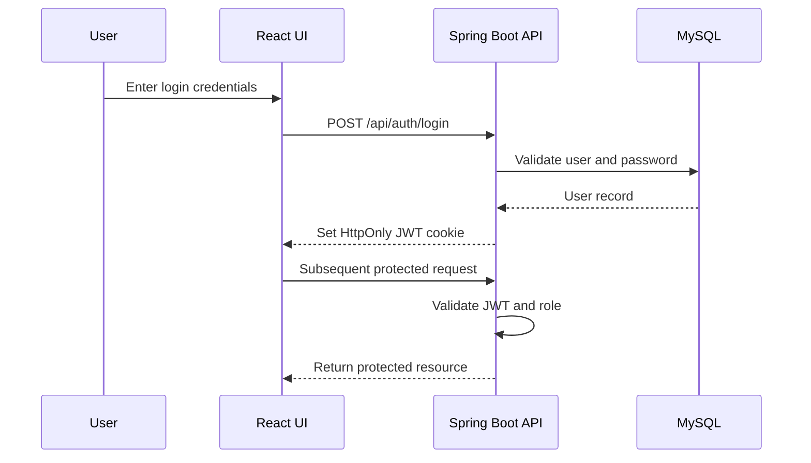
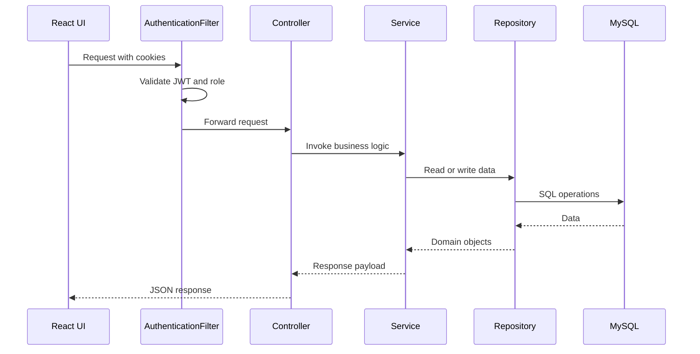
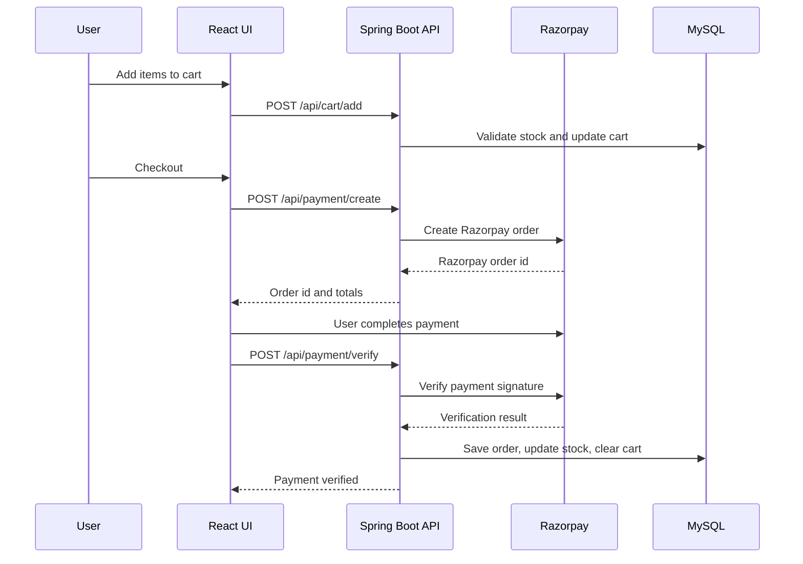
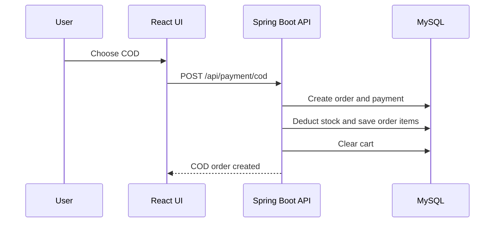
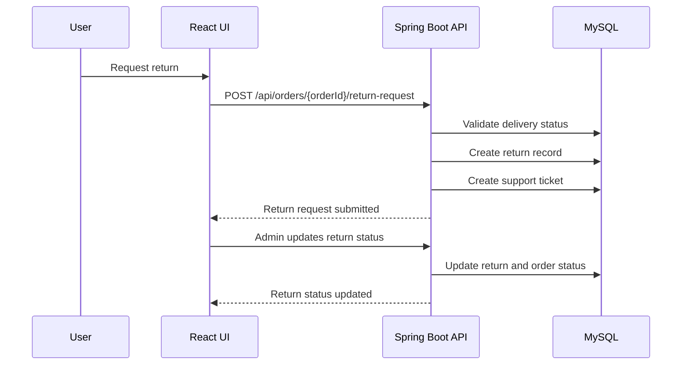
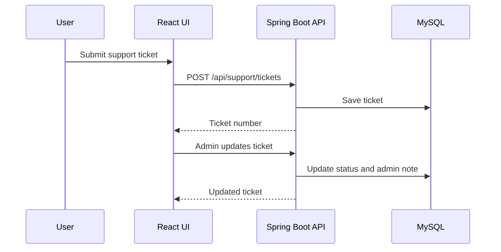
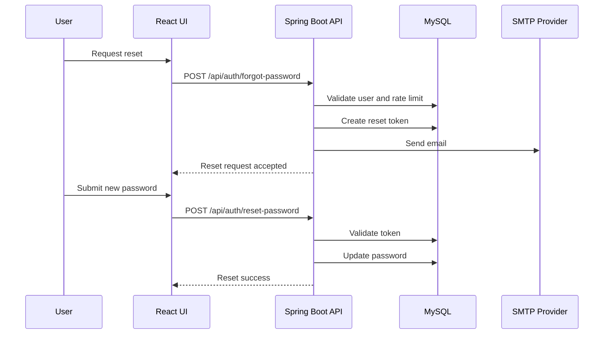
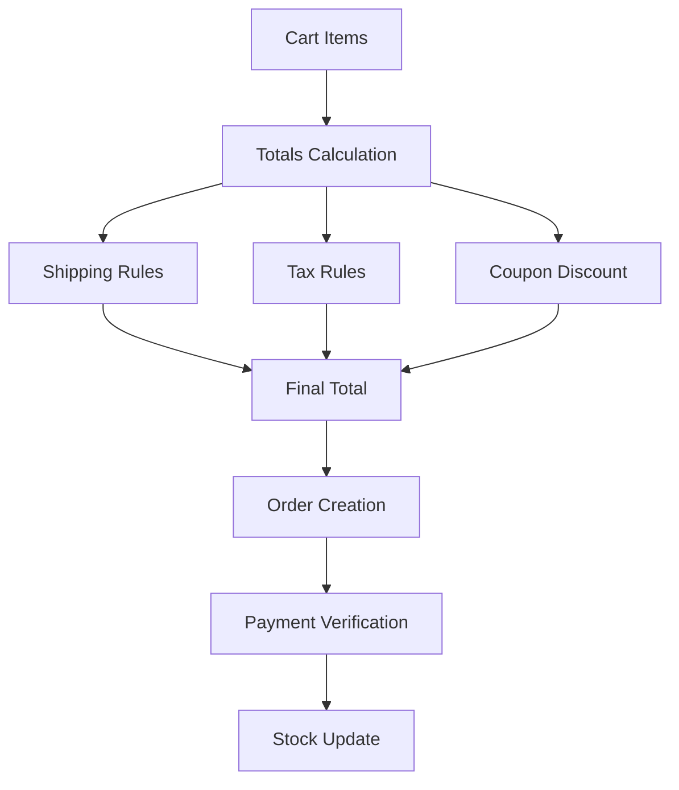

# ShopFusion Workflows

## User Authentication Flow

## API Request Lifecycle

## Checkout and Payment Flow

## COD Order Flow

## Return and Refund Flow

## Support Ticket Workflow

## Password Reset Workflow

## Data Processing Flow

